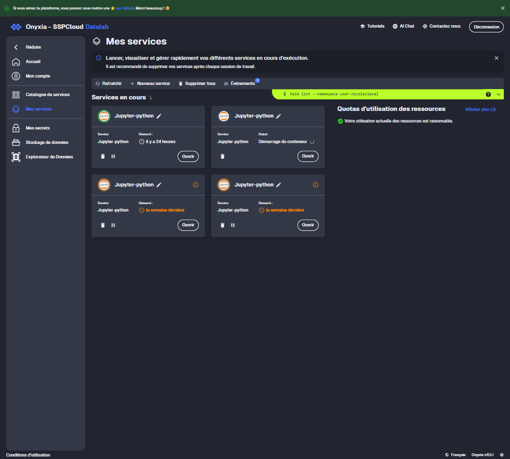
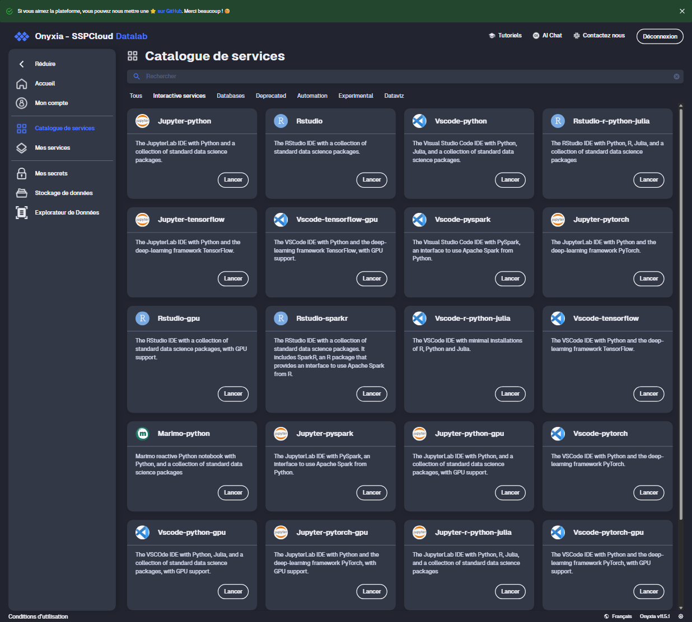
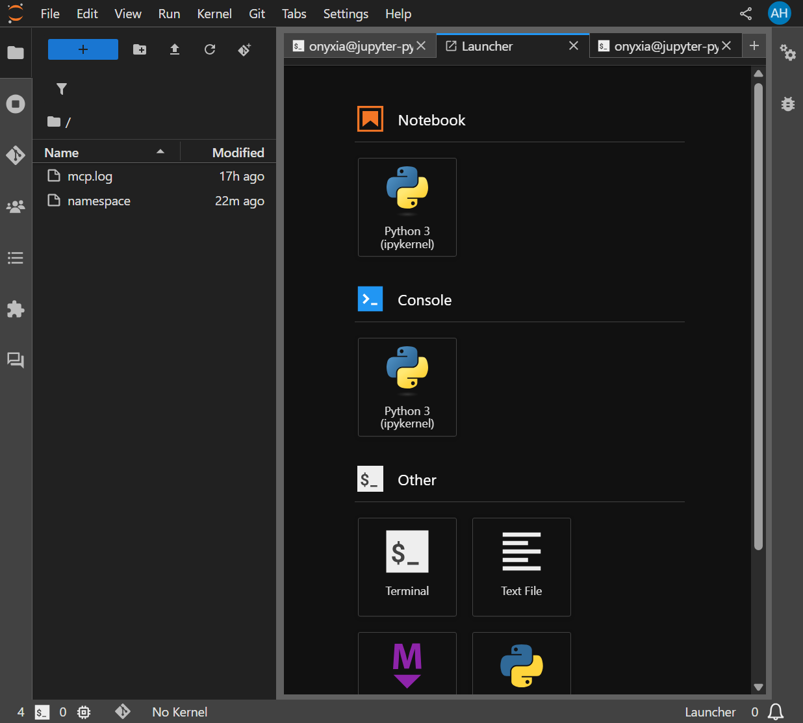

# Installation illustrée — sspcloud-mcp dans votre namespace SSPCloud

Ce guide montre, écran par écran, comment **installer le service pour vous-même**, dans
**votre** namespace SSPCloud, avec les droits de **votre** pod.

> **Usage strictement individuel.** Le service tourne dans votre namespace, opère avec le
> ServiceAccount de votre pod, et n'accède **jamais** aux pods d'un autre utilisateur.
> Il fonctionne **même si votre compte est restreint** (`stsonly`, sans droits kubectl
> directs) : c'est le pod, pas votre jeton personnel, qui porte les droits.

Durée : ~10 min.

---

## Étape 1 — Ouvrir « Mes services »

Connectez-vous sur [datalab.sspcloud.fr](https://datalab.sspcloud.fr), puis menu
**Mes services** (barre de gauche).



---

## Étape 2 — Lancer un service Jupyter-python

Cliquez **Nouveau service** → catalogue **Interactive services** → carte **Jupyter-python**
→ **Lancer**.



> Les valeurs par défaut conviennent. Vous **n'avez pas besoin de noter le mot de passe** :
> le service le lit tout seul dans le pod.

---

## Étape 3 — Ouvrir un terminal

Depuis **Mes services**, cliquez **Ouvrir** sur votre Jupyter (un écran affiche vos
identifiants — vous n'en avez pas besoin, cliquez pour ouvrir). Dans JupyterLab, ouvrez un
**Terminal** depuis le *Launcher* (section **Other**) :



---

## Étape 4 — Installer le service (une commande)

Dans le terminal :

```bash
pip install "git+https://gitlab.cerema.fr/mcp/sspcloud_mcp.git"
```

> Si le dépôt est privé, ajoutez un token de lecture :
> `pip install "git+https://oauth2:<VOTRE_TOKEN>@gitlab.cerema.fr/mcp/sspcloud_mcp.git"`

Vérifier :

```bash
python -c "import sspcloud_mcp; print('installé', sspcloud_mcp.__version__)"
```

À partir de là, le service peut, **depuis votre pod**, lancer et piloter des workers
(dev/GPU) **dans votre namespace** — validé end-to-end (self-drive + lancement de worker).

---

## Étape 5 — Exposer le service et connecter votre agent

Le serveur HTTP + **connecteur OAuth** est inclus (`sspcloud_mcp.server_http`, façon n8n).
Dans le terminal du pod :

```bash
# 1. Votre clé API (bearer) — c'est votre secret de connexion, gardez-la
export PASSERELLE_MCP_BEARER=$(openssl rand -hex 24); echo "$PASSERELLE_MCP_BEARER"

# 2. Lancer le serveur (écoute sur le port 8000)
PASSERELLE_MCP_PUBLIC_URL="https://<URL-PUBLIQUE-DE-VOTRE-SERVICE>" PORT=8000 \
  nohup python -m sspcloud_mcp.server_http > ~/work/mcp_http.log 2>&1 &
```

3. **Exposer le port 8000** publiquement : le service Jupyter doit avoir été lancé avec
   *Network access* (`networking.user`) pointant sur le port **8000**.
4. Dans **Claude Desktop / mobile** → *Ajouter un connecteur* → l'URL publique de votre
   service. Le flux **OAuth** vous demande votre clé API (celle de l'étape 1).

> **Note.** Exposer le port MCP proprement (sans masquer JupyterLab) est le plus simple via
> le **chart catalogue dédié** (palier 1). En attendant, lancez un service *dédié* au MCP
> avec le port réseau = 8000. Le code OAuth (DCR RFC 7591, PKCE) est complet ; cette section
> sera enrichie de captures dès la validation live.

---

## Périmètre & sécurité

- **Mono-namespace** : chaque commande n'agit que dans votre namespace, avec vos droits.
- **Aucun accès inter-utilisateur**, **aucun compte central privilégié**.
- Vos identifiants (mot de passe Jupyter, jetons) restent **dans votre pod** ; rien n'est
  renvoyé à l'agent.
